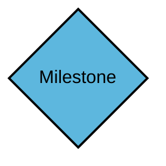
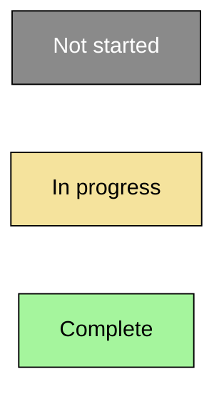
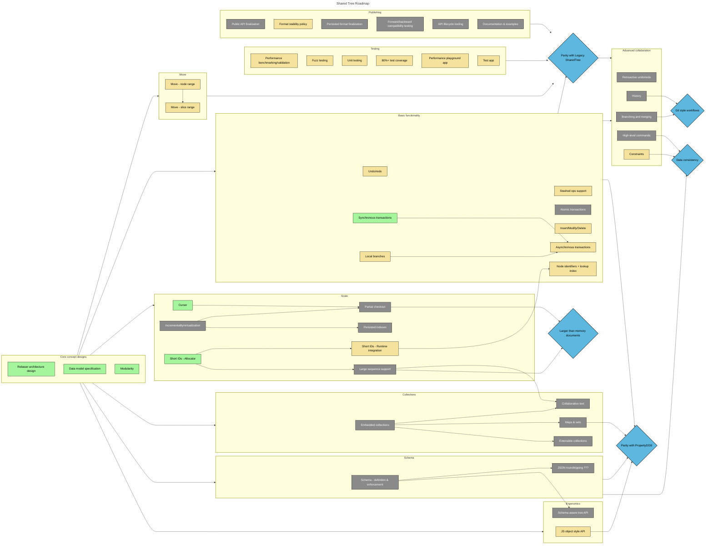

# Shared Tree: Project Overview

This document serves as an up-to-date view of the Shared Tree project, including the delivery milestones, the status of the current work, and future plans.

For more information on Shared Tree, including code examples and a high level description, see the [readme](../README.md).

# Focus Areas

The project is separated into three primary focus areas: **functionality**, **performance**, and **stability**.
The next sections detail the high-level goals for each area.
The individual investments of the Shared Tree project are roughly bucketed into a set of workstreams that roll up to the focus area to which they accrue value.
While these can often be implemented in parallel, there are often dependencies across them. Those dependencies and the progress in each workstream are detailed in the [roadmap](#roadmap) section.

## Functionality

The Shared Tree is composed of a uniquely expressive feature set that allows developers to easily build collaborative experiences, whether they are starting from scratch or adapting to an existing data model.
This area focuses on the tree can do this while being ergonomic and extensible.
It is covered much more extensively in other documents.
For a full list of the major features (existing and planned) in Shared Tree, see the [feature list](feature%20list.md).
For a better understanding of the value proposition of Shared Tree, see the [primer](primer.md).

Workstreams that accrue to _functionality_:

-   **Core concept designs**
-   **Basic functionality**
-   **Move**
-   **Ergonomics**
-   **Schema**
-   **Collections**
-   **Advanced collaboration**

## Performance

Fast performance lies at the heart of the Fluid Framework vision.
It was designed from the ground up to minimize latency introduced by servers by shifting merge responsibilities to the client.
Upholding and taking full advantage of this architecture is the top priority for Shared Tree.
These are the near-term performance goals:

-   Equivalent or better performance as compared with the experimental Shared Tree DDS
-   Include granular performance benchmarks for each Shared Tree component including reading and writing of the in-memory tree and merging changes
-   Build a benchmarking stress test app to set baselines and measure improvements
-   Architect the tree such that the lowest layers provide the best performance at the cost of ergonomics; build more friendly (but potentially slower) APIs on top, enabling applications to choose their preferred layer

As the Shared Tree feature set grows, the performance goals will also evolve to include the following:

-   Tree reading will be a reasonable constant factor as compared with reading a JS object tree as the tree grows in size and complexity
-   Collections within the tree such as long sequences, maps, and sets will be optimized
-   Summarization performance will scale with the scale of the data being changed – currently summarization performance is determined by the size of the complete data set
-   Boot performance can be optimized by loading only the data required through virtualization

Workstreams that accrue to _performance_:

-   **Scale**
-   **Performance testing**

## Stability

Shared Tree is a complex DDS aimed at supporting a broad range of data types and merge semantics.
As such, it is critical that Shared Tree investments include significant focus on reliability.
The following are some of the investments that will ensure Shared Tree is reliable and remains stable as it evolves:

-   Roughly 80% unit test coverage
-   Fuzz testing of all major components
-   Two or more test apps built on Shared Tree that are used to validate every significant update
-   Code for types and persisting state is isolated and policies are in place to ensure stable migrations between versions
-   Forwards and backwards compatibility tests
-   API lifecycle tooling to ensure smooth version rollouts

Workstreams that accrue to _stability_:

-   **Stability testing**
-   **Publishing**

# Roadmap

## Milestones

The Shared Tree project has many milestones, each of which enable a set of application scenarios.
Many share dependencies and they are often worked on in parallel.
The current milestones are:

-   **Basic data synchronization [COMPLETE]**
    -   For developers eager to start using the Shared Tree DDS, this milestone represents the point where they can do so for scenarios involving transient data.
        That is, at this stage developers can create a Shared Tree from other data and use it to sync that data between all clients.
        Insert, delete, and modify operations will be functional; however, the storage formats will not be final at this stage.
        There will be no data migration strategy for the data stored in the Shared Tree DDS at this stage.
        The move operation is also not yet available.
-   **Parity with Legacy Shared Tree [IN PROGRESS]**
    -   This milestone enables developers who were previously using the [legacy (experimental) Shared Tree](https://github.com/microsoft/FluidFramework/tree/main/experimental/dds/tree) to migrate to the Shared Tree.
        At this point, Shared Tree has feature, performance, and stability parity with its legacy counterpart; developers should switch to the new tree as the legacy version will not be under active development.
-   **Parity with PropertyDDS [IN PROGRESS]**
    -   This milestone enables developers who were previously using the [PropertyDDS](https://github.com/microsoft/FluidFramework/tree/main/experimental/PropertyDDS) to migrate to the Shared Tree.
        At this point, Shared Tree has feature, performance, and stability parity with PropertyDDS; developers should switch to the new tree as PropertyDDS will not be under active development.
-   **Larger-than-memory documents**
    -   This milestone enables documents to scale to arbitrarily large sizes, including those beyond the limits of client memory (or even disk).
        Applications will be able to view a subset of a document and build real-time collaborative editing flows on that subset regardless of the number of connected clients of the total size of the document.
-   **Git-style workflows**
    -   This milestone enables developers to build collaborative experiences that leverage the power of a source-control model, including branching, merging, viewing the history and rewinding to arbitrary points in time, and high-quality merge resolutions after being offline.
-   **Data consistency**
    -   This milestone provides powerful tools to ensure that data within the tree remains consistent with an application's data model regardless of concurrenct editing;
        these tools include the guarantee of data adhering to schema, the ability to specify when edits should conflict, and a high-level command model to capture editing intention.
        These empower developers to explore more complex and semantic collaboration scenarios.

## Current status

The following diagram shows the project's current progression towards delivering different milestones.

Milestones are displayed as blue diamonds:

The status of items within workstreams are shown via colors:

> Tip: learn more about each item by reading the [feature list](feature%20list.md).

